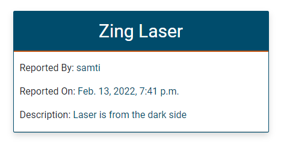

# Machinery Issue Reporting System


# Table of Contents
* [Background](#background "Background")
* [Mission Statement](#mission-statement "Mission Statement")
* [Target Audience](#target-audience "Target Audience")
* [Stakeholder Interviews](#stakeholder-interviews "Stakeholder Interviews")
    * [User Persona](#user-persona "User Persona")
    * [User Goals](#user-goals "User Goals")
    * [User Stories](#user-stories "User Stories")
    * [User Requirements and Expectations](#user-requirements-and-expectations)
        * Requirements
        * Expectations
    * [Site Owners Persona](#site-owner's-persona "Site Owner's Persona")
    * [Site Owners Goals](#site-owners-goals "Site Owner's Goals")
    * [Site Owners Stories](#site-owners-stories "Site Owner's Stories")
    * [Site Owners Requirements and Expectations](#site-owners-requirements-and-expectations "Site Owners Requirements and Expectations")
        * Requirements
        * Expectations
    * [Strategy](#strategy "Strategy")
        * Strategy Outline
        * Strategy Description
            * User
            * Site Owner
    * [Wireframes](#wireframes "Wireframes")
    * [Design Choices](#design-choices "Design Choices")
        * Fonts
            * Content
            * Headings
        * Colours
        * Images
    * [Structure](#structure "Structure")
        * Site Structure
        * Data Schema
        * Models
        * Forms
    * [Branches](#branches "Branches")
    * [Features](#features "Features")
        * Existing Features
        * Features to be implemented
    * [Technologies used](#technologies-used "Technologies used")
        * Languages
        * Libraries and Frameworks
        * Tools
    * [Testing](#testing "Testing")
        * Accessibility
        * UX Testing
        * Manual Testing
        * Code Validation
        * Bugs
        * Unfixed Bugs
    * [Deployment](#deployment "Deployment")
    * [Credits](#credits "Credits")

# Background
With the restrictions in place within teaching in the Irish Universities due to the Coronavirus pandemic, the improved organisation of working methods to reduce contact with staff and students over more trivial tasks have to be looked at. With this in mind, TU Dublin's engineering department has been looking to implement a machinery issue reporting system for the many machines to which the students have access. Currently, the engineering department is using a manual process where students write into a diary, where unnecessary physical touchpoints are created, or send an email where there is potential for loss of information to happen. They are looking to create an automated system to improve the procedure for all stakeholders.

# Mission Statement
Provide a fully automated, easily used and aesthetically pleasing machinery issue reporting system for TU Dublin.

# Target Audience
The target audience consists of approximately 150 students, both full time and part-time. The students are of a similar educational standard due to the course entry requirements but there is a selection that has extra educational needs so this needs to be addressed with accessibility built into the application.

There are three members of staff, one technician and two lecturers.

# Stakeholder Interviews
I carried out short interviews with both a selection of staff and students that this project will affect. All people interviewed will be *Users*, however for an easier view of the breakdown of requirements, I have split the results into *students* and *staff*.

## Student Persona
These are the details of the students interviewed. Two criteria were taken into consideration when selecting appropriate candidates for interviews. Firstly that they are either a part-time or full-time student of TU Dublin, and also that the course they are enrolled on is within the engineering department.

| Name | Age | Course | Education |
| -- | -- | -- | -- |
| Don Heslip| 22 | Automation Engineering | Leaving Cert |
| Aodhgon Smith | 19 | Aviation Technology | Leaving Cert |
| Niall McCarthy | 34 | Design Technology and Innovation | Leaving Cert |
| Elaine Cross | 22 | Structural Engineering | Leaving Cert |

## Student Goals
From the resulting interviews, the user goals have been defined:
* See what defects or issues have been reported
* See what defects or issues I have reported
* Clear display in a landing page
* Clear navigation process
* Ability to use the system on a mobile phone

## Student Stories
* As a student, I want to have a clear and defined landing page
* As a student, I want to be able to report aa issue on a machine
* As a student, I want to see any issues that I have reported
* As a student, I want to see the machine's name and description
* As a student, I want to see if there are any issues already reported on a machine
* As a student, I want to know this is a TU Dublin application

## Student Requirements and Expectations
### Requirements
* Simple and well laid out
* Visually appealing
* TU Dublin colour pallet
* Clean and modern looking
* Easy to report an issue in just a few clicks
* Responsive design is required (Mobile first) as users may be viewing the site on Mobile, Tablet or Desktop

### Expectations
* I expect to use the application on any size device without the experience effected
* I expect that when I report an issue I can see that it has been logged
* I expect to be able to report issues on multiple machines

## Staff Persona
These are the details of the staff interviewed. The staff members will all be teaching in TU Dublin, within the engineering department. There are three staff that fit this category, two lecturers and one technician. Unfortunately, I was only able to interview one lecturer.

| Title | Description 
| -- | --
| Name | Keith Colton
| Age | 40
| Position | Assistant Lecturer in Product Design
| Education | Postgraduate Diploma Third Level Learning and Teaching, MSc Sports Engineering


## Staff Goals
From the resulting interview, the site owner's goals have been defined:
* Create a machine with a short description
* Delete a machine when required
* Edit a machine's details when required 
* See any issues that have been reported
* Change the status of a machine with an issue
* Delete an issue when it has been rectified
* Clear navigation process
* Visually clear that it is a TU Dublin application


## Staff Stories
* As a site owner, I want to see any issues with machines that have been reported
* As a site owner, I want to delete an issue when it is rectified
* As a site owner, I want to provide a description of the machine for the user
* As a site owner, I want to provide an image of the machine for the user
* As a site owner, I want to manage the users

## Staff Requirements and Expectations
### Requirements
* A higher level account than a student
* Different sections in the login to manage the different tasks
* Create, Read, Update and Delete functionality
* Simple and well laid out
* Visually appealing
* TU Dublin colour pallet
* Clean and modern looking

### Expectations
* I expect to quickly manage users
* I expect to quickly manage machines
* I expect to quickly delete issues on machines when required
* I expect to know this application is associated with TU Dublin


## Strategy
### Strategy Outline
The items are graded in a 0 - 5 system in both importance and feasibility as per the grading system below.

&nbsp;

| | Score - 0 | Score - 3 | Score - 5 |
|--|--|--| -- |
| Importance | Unwise use of time to address | Efforts should be made to accommodate these | Efforts MUST be made to address these
| Feasibility | Unwise use of time to address| Efforts should be made to accommodate these | Efforts MUST be made to address these

&nbsp;

The outcome is calculated by combining the scores from the *Importance* and *Feasibility* ratings. This then gives a final strategy rating of what items and where to focus on.

| | Score - 0 | Score - 5 | Score - 10 |
|--|--|--| -- |
| Item Description | Not viable | Efforts should be made | Efforts MUST be made

&nbsp;

### Strategy Description

#### Student 

|Item Description | Importance Score | Feasibility Score | Outcome |
| --------------- | ----------| -----------| ----------|
| See what defects or issues have been reported | 5 | 5 | 10 |
| See what defects or issues I have reported | 5 | 5 | 10 |
| Clear display in a landing page | 5 | 5 | 10 |
| Clear navigation process | 5 | 5 | 10 |
| Ability to use the system on a mobile phone | 5 | 5 | 10 |


#### Site Owner

|Item Description | Importance Score | Feasibility Score | Outcome |
| --------------- | ----------| -----------| ----------|
| A higher level account than a standard user | 5 | 5 | 10 |
| See any problems with machines that have been reported | 5 | 5 | 10 |
| Manage the users | 5 | 5 | 10 |
| Delete an issue when it is rectified | 5 | 5 | 10 |
| Delete a machine| 5 | 5 | 10 |
| Edit a machine's details| 5 | 5 | 10 |
| Create a new machine with a description| 5 | 5 | 10 |
| Create a new machine with an image| 5 | 5 | 10 |
| TU Dublin colour pallet | 5 | 5 | 10 |


\
&nbsp;
[Back to Top](#table-of-contents)
\
&nbsp;


# Wireframes
Originally, the design was that the user immediately was bought to the login page, however, following the agile process, I received feedback from the client that this was no longer the case and they requested a landing page. This is the wireframe for this page.


Login screens and edit information pages will be a very simple look with an image in the background and the form centred on all screen sizes.


The other screens, dashboard and current issues screens will display the items in a simple grid display to keep the pages uniform.


The individual machine page will be simple and will hold the title, description, image and the report an issue form.


The manage users page will be displayed as a simple table 

<!-- ADD WIREFRAME WHEN BALSAMIC LICENCE FOR 2022 IS RELEASED -->

\
&nbsp;
[Back to Top](#table-of-contents)
\
&nbsp;


## Design Choices
Because this project is being created for TU Dublin, and all the user's requirements include the need for it to be within keeping of the existing designs, the following design choices will be based on this.

### Fonts
The font that TU Dublin currently uses is [Visuelt-Regular](https://www.colophon-foundry.org/typefaces/visuelt/ "Visuelt-Regular"), this, however, is a font that would have to be bought and not something that is going to happen with this project. Because of this, I have picked a font from [Google Fonts](https://fonts.google.com/ "Fonts") that is as close as I can get to keep the user experience as close as possible.

#### Content 
Using a font weight of 300, [Roboto](https://fonts.google.com/specimen/Roboto "Roboto")

#### Headings
Using a font-weight of 900 and styled to be uppercase, [Lato](https://fonts.google.com/specimen/Lato "Lato")


### Colours
The colours will be set variables within the CSS file using the names in the table below.

| Colour | HEX | Usage |
|--|--| --|
| Blue | #004C6C | Navigation bar, Footer, Cards, Tables |
| White | #FFFFFF | Site background, Text |
| Orange | #BF510D | Buttons, Links,  |
| Red | #A90F26 | Buttons, Links |
| Green | #005C48 | Buttons, Links |

To keep the user experience consistent, the colour red will be used for deletion, orange for editing and green for the creation or to cancel an action.


The colours all pass the [WebAIM](https://webaim.org/resources/contrastchecker/ "WebAIM") tests and the results can be seen below.

* [Blue](readme/docs/designs/contrast-checker-blue.png)
* [Orange](readme/docs/designs/contrast-checker-orange.png)
* [Red](readme/docs/designs/contrast-checker-red.png)
* [Green](readme/docs/designs/contrast-checker-green.png)


# Structure
## App Flow
The basic template views displays have been planned out using [Lucid](https://lucid.co/ "Lucid").

| Colour | Details|
|---|---|
| Blue | The user authentication process |
| Green | Visible to all users  |
| Yellow | Visible to only staff |


## Data Schema
The data schema was created using [dbdiagram](https://dbdiagram.io/home "dbdiagram").


## Models

### Machine

| Name | Key | Type | Other Details |
| -- | -- | -- | -- |
| name | | CharField | Max length 50 and unique |
| slug | | SlugField | Max length 200 and unique|
| description | | TextField | |
| status || IntegerField | From STATUS and default of 1 (Working)|
| image ||CloudinaryField| Set default as 'placeholder' |

### Issues

| Name | Key | Type | Other Details |
| -- | -- | -- | -- |
| description | | TextField | |
| created_at || DateTimeField | Auto, now|
| rectified ||BooleanField| From ISSUE_RECTIFIEDand default of 0 (Not Rectified) |
| machine | FK from Machine || On delete cascade, set related_name |
| user | FK from User || On delete set to deleted_user, set null, set related_name |

### User

This will be initally built at the start of the app as an empty model, giving me the oportunity to adapt the Django User fields if required.

## Forms

\
&nbsp;
[Back to Top](#table-of-contents)
\
&nbsp;


# Branches
The majority of my code was written using branches in Gitpod. As I was new to this process, occasionally I was over-eager and pushed my changes straight to the main branch however this is in a minority as can be seen through the commit history. In a normal project, I would have deleted all my branches, except for the default main, however, I have chosen to keep four as examples of the process.

* [Branch 1](https://github.com/sam-timmins/machine-issue-reporting-system/tree/testing/Issue%2399-toggle-is_staff "#1") created to work on [Issue #99](https://github.com/sam-timmins/machine-issue-reporting-system/issues/99 "#99")
* [Branch 2](https://github.com/sam-timmins/machine-issue-reporting-system/tree/testing/Issue%2399-toggle-is_staff "#2") created to work on [Issue #94](https://github.com/sam-timmins/machine-issue-reporting-system/issues/94 "#94")
* [Branch 3](https://github.com/sam-timmins/machine-issue-reporting-system/tree/testing/Issue%2399-toggle-is_staff "#3") created to work on [Issue #91](https://github.com/sam-timmins/machine-issue-reporting-system/issues/91 "#91")
* [Branch 4](https://github.com/sam-timmins/machine-issue-reporting-system/tree/testing/Issue%2399-toggle-is_staff "#4") created to work on [Issue #88](https://github.com/sam-timmins/machine-issue-reporting-system/issues/88 "#88")


\
&nbsp;
[Back to Top](#table-of-contents)
\
&nbsp;


# Features

## Existing Features

### Spin Loader
The spin loader was generated using [loading.io](https://loading.io/ "Link") and is displayed on all pages until the document is loaded. When it has, it fades away to show the content of the application.


### Navbar
The navbar is fully responsive and has been created to have different links available, depending on if the user is signed in or not.

While the user has not been authenticated or signed in to the application, on display are the Login and Signup links only. The university logo at this point acts as a link back to the landing page.
\
&nbsp;


The same applies to the links for the mobile view, however, the styling is adjusted to be responsive. A hamburger menu is used to slide from the right side of the screen. The location of the hamburger in the top right corner of the screen is to suit the 90% majority of right-handed people.
\
&nbsp;


\
&nbsp;

For a basic user, once signed in the options on the navbar change to show:

* University name - *links to the dashboard*
* Dashboard - *links to the dashboard*
* Issues - *links to the issues page*
* Profile - *links to the edit profile page*
* Logout - *links to the logout page*
* Machine search - *opens machine name search bar*

The orange underline of the link shows the active page to the user, also a hover effect of changing colour on the text adds to the user experience. The search feature on the mobile layout moves in and leaves the hamburger on the edge, to improve user experience as the hamburger is more likely to be used more often.
\
&nbsp;


\
&nbsp;


\
&nbsp;


For a staff member, once signed in the options on the navbar change to add extra dropdowns:

* University name - *links to the dashboard*
* Dashboard
    * View Machines - *links to the dashboard*
    * Create Machine - *links to the create a machine page*
* Issues - *links to the issues page*
* Profile
    * Edit Profile - *links to the edit profile page*
    * All Users - *links to the all users page*
* Logout - *links to the logout page*
* Machine search - *opens machine name search bar*

\
&nbsp;


\
&nbsp;


The search feature in the navbar is available to both staff and basic users. It searches the machine database based on the machine name and this is prompted through the placeholder text. There is also a fade in and out on this element to improve the experience.

\
&nbsp;


\
&nbsp;

\
&nbsp;

### Footer
The footer comprises two elements, the university name with auto increment copyright year and links to their social accounts. The layout changes slightly depending on screen size, the social links are moved to a fade in and out container on the smaller screen sizes. This container can fade out when either the user scrolls back up the screen, or if they click elsewhere in the body of the application.

\
&nbsp;


\
&nbsp;


\
&nbsp;

\
&nbsp;

### Messages
Messages are displayed for continual feedback to the user on their interactions and follow the same layout for both mobile and desktop designs. These interactions include:

* Sign in
* Logout
* Create a machine
* Update a machine
* Delete a machine
* Create an issue
* Delete an issue
* Edit profile
* Edit staff status of a user

\
&nbsp;


\
&nbsp;


\
&nbsp;

\
&nbsp;

### Homepage
The home page is a simple set-up with two elements, the hero image and the information cards.

The hero image of a machine is fitting with the context of the project and the colour scheme also suits perfectly with the universities pallet. The text container is consistent with TU Dublin's site so it helps with the staff user story of needing to know that it is associated with the university.


The information cards give a brief outline of the reasoning behind the development of the application. The information is helped by the use of icons and is also responsive by stacking on top of each other for smaller devices.

* Desktop


* Mobile


### Dashboard

The dashboard includes a personal welcome to the user and introduces them to the dashboard. The machines that are created by the staff members are displayed here with the view changing depending on authentication level. 

If the user is logged in as a staff member, the delete and edit buttons will be displayed if the user is a basic user, the card with the image and title are displayed. The image and the title also act as a link that navigates to the detailed view of the machine. 

If an issue has been raised on one of the machines, then a warning note also shows on the card. The cards are ordered firstly by if there are any issues reported, then in alphabetical order.

* Staff view


* Basic User view


To keep the display of the machine cards compact, there is pagination built into the application. Only six items will be displayed on the screen at one time, if there is more the next and previous buttons will navigate to these items.


There is also notification to the users if there are no machines currently created. This provides a short explination and a shortcut link to create a new machine.


\
&nbsp;
### Machine Details

The machine details page shows the detailed description of the provided by a staff member when the machine was created. This is also where a user can create an issue using the *Report an Issue* button. This opens the form in the way of a modal with the machine name populated. The Cancel button closes the modal, and the submit button add the issue to the database and gives the user a message of confirmation.

\
&nbsp;


\
&nbsp;

\
&nbsp;

### Issues

At the very top of the issues page, there is a search bar, that works in the very same way as the machines name search, only it searches through the descriptions in the issues.


The issues page, like the dashboard, is made up of a series of issue cards order by the date that they were created on. These contain:

* The machine name
* The username of the user that created it
* Timestamp of when it was created
* Description left by the user
* For staff members only, the Delete button.
\
&nbsp;
* Staff view


* Basic view



Only visible to staff members is the delete button when it is clicked, a defensive model pops up to ensure that the user is sure that they would like to delete the issue, on the confirmation, the issue is deleted from the database and a message is relayed to the user.


On deletion of the last issue or, if there have been none created yet, there is a prompt to the user so they are aware of this.


### All Users
This page is only available to the staff users of the application. At the top of the page, there is a search bar that can be used to search for the user's usernames, working in the same way as the previously detailed searches in the application. The main content consists of a table populated with a full list of all registered users and displays some of their details:

* Username
* First name
* Last name
* Staff status


Each user also has an edit button associated with it and a delete button. The edit button allows a staff member to give another user full accessibility to the application. On clicking update, a message is displayed showing that the staff status has been changed for that particular user.


The delete button opens up a model for a defensive confirmation that this is the action wanted to be carried out. On deletion, the user is removed from the database.


### Edit Profile
The edit profile page is available to all user levels. This page gives the user the ability to adjust their details:

* Username
* Email
* First name
* Last name

The update button updates the database and gives the user a message to confirm the profile was updated, and the cancel button returns to the dashboard.


### Authentication

The authentication process for the application has three parts.

* Sign Up
* Sign In
* Log out

#### Sign Up
The signup process requests three required fields from the user:

* Username
* Password
* Password confirmation


If the user enters a username that already exists, or the two password fields do not match, then error messages are prompted to the user.


If all the fields are correctly populated and the Sign-Up button is clicked the user is navigated to the dashboard and a message is displayed to tell the user that they are successfully signed in. If the user has already registered and is looking to sign in then there is a handy link to the correct page in the text above the form.

### Sign In
The sign-in form requires only two fields to be entered. 

* Username
* Password


Like the signup form, there are messages displayed if incorrect or non-matching data is entered. And a link to the signup page if the user has not already done so. The sign-in button, with correct credentials, directs the user to the dashboard with a successfully logged in message.


### Log out

This is the simplest of the three authentication form in the application. a simple choice of yes or no if the user would like to sign out. The yes button directs the user to the homepage with a message letting them know they have successfully logged out, and the no button directs the user back to the dashboard page.


## Buttons
The buttons on the application, for consistency, have the same design, with the only difference being the colours.

* Green is for confirming an update or creating


* Red is for deletion


* Orange is for editing or cancelling an action


All buttons also have the same hover effect to keep the user experience consistant.


## Features to be Implemented

* Multiple filters on the issues filter.
    * By filtering by machine name and description, this would allow better flexibility for the user to narrow the search down and speed up the process of searching.
* Booking system.
    * By adding a booking system into this application, the users would easily see the availability of machines. If there were current issues on the machine, it would be unavailable for use.
* Email or push notification
    * A notification to the staff members that an issue has been created would speed up the process as they would not have to log in each time to see the status of machines
* Automatic logout after a set period of idle time
    * A security addition if a staff user forgets to log out themselves out, the application does it automatically so another user cannot have access.

\
&nbsp;
[Back to Top](#table-of-contents)
\
&nbsp;

# Technologies used

## Languages
| Languages | Description | Link |
|--|--|--|
|HTML|[HTML](https://en.wikipedia.org/wiki/HTML5 "HTML") | for the structure of the site
|CSS|[CSS](https://en.wikipedia.org/wiki/CSS "CSS") | for the design of the site
|JavaScript|[JavaScript](https://en.wikipedia.org/wiki/JavaScript "JS") | for the design of the site
|jQuery|[jQuery](https://jquery.com/ "jQuery") | for animations in the site
|Python|[Python](https://en.wikipedia.org/wiki/Python_(programming_language) "Python") | for the backend interactions
|Markdown|[Markdown](https://en.wikipedia.org/wiki/Markdown) | for the content in my README file

## Libraries and Frameworks
| Libraries / Frameworks | Description | Link |
|--|--|--|
|Django|Database Driven Framework| [django](https://en.wikipedia.org/wiki/Django_(web_framework) "django")|
|gunicorn|HTTP Interface Server|[gunicorn](https://en.wikipedia.org/wiki/Gunicorn "gunicorn")|
|psycopg2| Database adaptor | [psycopg2](https://wiki.postgresql.org/wiki/Psycopg "psycogg2")
|cloudinary |Image management|[cloudinary](https://cloudinary.com/ "cloudinary")|
|django auth|User authentication|[auth](https://docs.djangoproject.com/en/3.2/topics/auth/ "auth")|
|django widgit tweaks|Formats forms||


## Tools
| Tools | Description | Link |
|--|--|--|
| Google Fonts| Fonts |[Google Fonts](https://fonts.google.com/ "Fonts")|
| WebAIM| Colour contrast checks |[WebAIM](https://webaim.org/resources/contrastchecker/ "WebAIM")|
| Lucid | Site structure design | [Lucid](https://lucid.co/ "Lucid")
| dbdiagram | Data schema design | [dbdiagram](https://dbdiagram.io/home "dbdiagram")
| coolors|Colour pallet| [coolors](https://coolors.co/ "coolors")|
| GitPod | Development environment |[Gitpod](https://www.gitpod.io/ "Gitpod")
| Balsamic | Wireframes |[Balsamic](https://balsamiq.com/wireframes/ "Balsamic")
| Bootstrap | Responsive design |[Bootstrap](https://getbootstrap.com "Bootstrap")
| Font Awesome | Icons |[Font Awesome library](https://fontawesome.com/ "Font Awesome")
| miniwebtool | Secret Key |[Secret Key Generator](https://miniwebtool.com/django-secret-key-generator/ "miniwebtool")
| Unsplash | Images |[Unsplash](https://unsplash.com/ "Unsplash")
| coverage | Testing | [Coverage](https://coverage.readthedocs.io/en/6.3.1/ "Coverage")
| WAVE | Accessibility Testing | [WAVE](https://wave.webaim.org/ "Wave")
| W3C | Markup Validation | [W3C Markup Validation Service](https://validator.w3.org/ "W3C")
| W3C | CSS Validation | [W3C CSS Validation Service](https://jigsaw.w3.org/css-validator/ "W3C")
| PEP8 | Python Validation | [PEP8](http://pep8online.com/ "PEP8")
| JSHint | JavaScript and JQuery Validation | [JSHint](https://jshint.com/ "JSHint")
| LOADING.IO | Spin Loader | [loading.io](https://loading.io/ "loading.io")


# Testing

## Accessibility

With accessibility included as a user goal, I have tested the pages of the application using [WAVE](https://wave.webaim.org/ "Wave") to ensure there are no errors. The results can be seen by following the links below. Each test shows that there are 2 contrast errors, these errors are where WAVE is picking up screen reader only spans and suggesting that they have a poor ratio between the back and foreground colours. These two elements are not visible to the user as they hold the bootstrap class of *sr-only*, so the errors here can be ignored.

* [Homepage accessibility results](readme/docs/accessibility/homepage-accessibility-check.png "Homepage")

* [Dashboard accessibility results](readme/docs/accessibility/dashboard-accessibility-check.png "Dashboard")

* [Individual Machine accessibility results](readme/docs/accessibility/individual-machine-accessibility-check.png "Individual Machine")

* [Create Machine accessibility results](readme/docs/accessibility/create-machine-accessibility-check.png "Create Machine")

* [Edit Machine accessibility results](readme/docs/accessibility/edit-machine-accessibility-check.png "Edit Machine")

* [All Users accessibility results](readme/docs/accessibility/all-users-accessibility-check.png "All Users")

* [Issues accessibility results](readme/docs/accessibility/issues-accessibility-check.png "Issues Machine")


\
&nbsp;

### UX Testing

#### Staff Member

| Requirements & Expectations | Implemented | Tested | Comments
| ------------ | ----------- | ------ | --------
| A higher level account than a student | Yes | Yes | Create, edit and delete machines, delete issues and edit staff status of users
| Different sections in the login to manage the different tasks | Yes | Yes | Dashboard deals with the machines, Issues with issues and Profile for users profiles
| Create, Read, Update and Delete functionality | Yes | Yes | CRUD functionality for issues and machines
| Simple and well laid out and visually appealing | Yes | Yes | Uncomplicated in the layout and clear navigation
| TU Dublin colour pallet | Yes | Yes | Colours adapted from TU Dublin's website
|I expect to quickly manage users|Yes|Yes| Staff status can be easily changed along with deleting a user
|I expect to quickly manage machines|Yes|Yes|CRUD functionality is obvious to see and carry out
|I expect to quickly delete issues on machines when required|Yes|Yes|Delete issues button clearly associated with the issue and defensive confirmation built-in

&nbsp;

| Goals | Implemented | Tested | Comments
| ------------ | ----------- | ------ | --------
|Create a machine with a short description|Yes|Yes|
|Delete a machine when required|Yes|Yes| Complete
|Edit a machine's details when required|Yes|Yes| Complete
|See any issues that have been reported|Yes|Yes| Complete
|Change the status of a machine with an issue|Yes|Yes| Complete
|Delete an issue when it has been rectified|Yes|Yes| Complete
|Clear navigation process|Yes|Yes| Complete
|Visually clear that it is a TU Dublin application|Yes|Yes| Complete

\
&nbsp;

#### Student User

| Requirements & Expectations | Implemented | Tested | Comments
| ------------ | ----------- | ------ | --------
| Simple and well laid out and visually appealing | Yes | Yes | Uncomplicated in the layout and clear navigation
| TU Dublin colour pallet | Yes | Yes | Colours adapted from TU Dublin's website
|Easy to report an issue in just a few clicks|Yes|Yes|Report issue button is clear in its association with the machine and completed in three clicks
|Responsive design is required (Mobile first) as users may be viewing the site on Mobile, Tablet or Desktop|Yes|Yes|Fully responsive and built mobile-first
|I expect that when I report an issue I can see that it has been logged|Yes|Yes|Messages appear on the screen  to confirm an issue has been created
|I expect to be able to report issues on multiple machines|Yes|Yes|Multiple issues can be reported on multiple machines


&nbsp;

| Goals | Implemented | Tested | Comments
| ------------ | ----------- | ------ | --------
|See what defects or issues have been reported|Yes|Yes|Complete
|See what defects or issues I have reported|Yes|Yes|Complete
|Clear display in a landing page|Yes|Yes|Complete
|Clear navigation process|Yes|Yes|Complete
|Ability to use the system on a mobile phone|Yes|Yes|Complete

\
&nbsp;
[Back to Top](#table-of-contents)
\
&nbsp;

## Manual Testing

Manual testing of the project was a continual process to ensure that all was working as expected. Items were fixed as the project was being carried out to ensure not to have a huge workload of fixes at the end. Manual testing and checks include:

* Loading Spinner
    * Displays on all pages while the content is loading
    * Centered in the page
    * Fade effect to display none

* Navbar
    * All links navigate to correct endpoint
    * All hover and focus effects are correct
    * Active link underlined
    * Different views depending on staff status and authentication
    * Search bar fades out when the body is clicked
    * Accessibility is correct
    * Responsiveness

* Footer
    * All links navigate to correct endpoint
    * All hover and focus effects are correct
    * External links open in a new tab
    * Accessibility is correct
    * Responsiveness

* HomePage
    * Text is clear and easily read
    * Image is shown and colours are complementary to the site
    * Information boxes clear and free of spelling mistakes
    * Responsiveness

* Login and Signup
    * Form is clear
    * Links navigate to the appropriate page
    * Hover and focus effect on the button
    * Background image clear visible
    * Form completes its task correctly

* Logout
    * Options are clear
    * Hover and focus effect on the buttons
    * No button returns to the dashboard
    * Yes button logs the user out and returns to the homepage
    * Message displayed to the user on the homepage when logged out

* Dashboard
    * Username is displayed in the page title
    * Content displayed if there are no machines created
    * Create machine button to link to the correct page
    * Hover and focus effect on the buttons
    * Machine cards to display edit and delete buttons to staff users only
    * Delete button opens confirmation modal
    * Confirmation modal delete button deletes the machine
    * Confirmation modal cancel button returns to the dashboard
    * Image and machine name act as a link to the machine details view
    * Current issues banner displayed when an issue is created against the machine
    * Pagination occurs when there are more than 6 items
    * Responsiveness

* Create Machine
    * Only accessible by a staff user
    * Responsiveness
    * Required fields must be completed
    * File upload works as expected
    * Hover and focus effect on the buttons
    * Cancel button returns to the dashboard
    * Submit button saves the machine, redirects and displays it on the dashboard

* Issues
    * Content displayed if there are no issues
    * Pagination occurs when there are more than 6 items
    * Username, date and description displayed in the issue card
    * Hover and focus effect on the buttons
    * Delete button only visible to a staff user
    * Delete button opens confirmation modal
    * Confirmation modal delete button deletes the issue
    * Confirmation modal cancel button returns to the issues page
    * Search bar filters the issues by description
    * Search bar X button clears the filters and displays all issues

* Edit Profile
    * Responsiveness
    * Required fields must be completed
    * Hover and focus effect on the buttons
    * Cancel button returns to the dashboard
    * Update button saves the profile changes, redirects to the dashboard and displays a message to the user confirming a change

* All Users
    * Only accessible by a staff user
    * Responsiveness
    * Hover and focus effect on the buttons
    * Delete button opens confirmation modal
    * Confirmation modal delete button deletes the user
    * Confirmation modal cancel button returns to the all users page
    * Edit button navigates to the edit staff status page
    * Correct staff icon displayed in the table
    * Search bar filters the users by username
    * Search bar X button clears the filters and displays all users

* Edit Staff Status
    * Username is displayed in the text content
    * Checkbox is either ticked or not depending on the current status
    * Hover and focus effect on the buttons
    * Update button saves the changes, redirects to the all users page and displays a message for confirmation
    * Cancel button navigates back to the all users page with no changes

## Code Validation

### HTML
The HTML code within the application has been validated by [W3C Markup Validation Service](https://validator.w3.org/ "W3C"). Pages were put through the validator seperatly and the results can be seen below.

* [Homepage HTML validation results](readme/docs/validation/html/homepage-markup-validation.png "Homepage")

* [Dashboard HTML validation results](readme/docs/validation/html/dashboard-markup-validation.png "Dashboard")

* [Individual Machine HTML validation results](readme/docs/validation/html/individual-machine-validation/html-check.png "Individual Machine")

* [Create Machine HTML validation results](readme/docs/validation/html/create-machine-markup-validation.png "Create Machine")

* [Edit Machine HTML validation results](readme/docs/validation/html/edit-machine-markup-validation.png "Edit Machine")

* [All Users HTML validation results](readme/docs/validation/html/all-users-markup-validation.png "All Users")

* [Issues HTML validation results](readme/docs/validation/html/issues-markup-validation.png "Issues Machine")

* [Signup HTML validation results](readme/docs/validation/html/signup-markup-validation.png "Sign up")

* [Sign in HTML validation results](readme/docs/validation/html/signin-markup-validation.png "Sign in Machine")

* [Log out HTML validation results](readme/docs/validation/html/logout-markup-validation.png "Log out Machine")

### CSS
The CSS code within the application has been validated by [W3C CSS Validation Service](https://jigsaw.w3.org/css-validator/ "W3C"), and the results can be seen below.

* [CSS validation results](readme/docs/validation/css/css-validation.png "CSS")


### JS
The JavaScript and JQuery code within the application has been validated by [JSHint](https://jshint.com/ "JSHint"), and the results can be seen below.

* [JS validation results](readme/docs/validation/js/js-validation.png "CSS")

### Python
The Python code within the application has been validated by [PEP* Validation Service](http://pep8online.com/ "PEP*"). Files were put through the validator separately and the results can be seen below.

* issue_reporting project
    * [settings.py validation results](readme/docs/validation/python/issue_reporting/issue_reporting-settings-python-validation.png "settings.py")
    * [urls.py validation results](readme/docs/validation/python/issue_reporting/issue_reporting-urls-python-validation.png "urls.py")

* accounts app
    * [forms.py validation results](readme/docs/validation/python/accounts/accounts-forms-python-validation.png "forms.py")
    * [test_forms.py validation results](readme/docs/validation/python/accounts/accounts-test_forms-python-validation.png "test_forms.py")
    * [views.py validation results](readme/docs/validation/python/accounts/accounts-views-python-validation.png "views.py")
    * [test_views.py validation results](readme/docs/validation/python/accounts/accounts-test_views-python-validation.png "test_views.py")
    * [urls.py validation results](readme/docs/validation/python/accounts/accounts-urls-python-validation.png "urls.py")

* home app
    * [urls.py validation results](readme/docs/validation/python/home/home-urls-python-validation.png "urls.py")
    * [views.py validation results](readme/docs/validation/python/home/home-views-python-validation.png "views.py")
    * [test_views.py validation results](readme/docs/validation/python/home/home-test_views-python-validation.png "test_views.py")

* issue app
    * [admin.py validation results](readme/docs/validation/python/issue/issue-admin-python-validation.png "admin.py")
    * [forms.py validation results](readme/docs/validation/python/issue/issue-forms-python-validation.png "forms.py")
    * [models.py validation results](readme/docs/validation/python/issue/issue-models-python-validation.png "models.py")
    * [views.py validation results](readme/docs/validation/python/issue/issue-views-python-validation.png "views.py")
    * [urls.py validation results](readme/docs/validation/python/issue/issue-urls-python-validation.png "urls.py")
    * [test_models.py validation results](readme/docs/validation/python/issue/issue-test_models-python-validation.png "test_models.py")
    * [test_views.py validation results](readme/docs/validation/python/issue/issue-test_views-python-validation.png "test_views.py")

\
&nbsp; 


## Bugs

1. [Issue #36](https://github.com/sam-timmins/machine-issue-reporting-system/issues/36 "#36") - Delete machine modal
    * The incorrect title was entered on the modal, hot-fix changed this.
1. [Issue #34](https://github.com/sam-timmins/machine-issue-reporting-system/issues/34 "#34") - Create machine form styling
    * Styling was correct and made to be responsive
1. [Issue #46](https://github.com/sam-timmins/machine-issue-reporting-system/issues/46 "#46") - Cancel button on Create Machine page
    * The cancel button was not directed back to the correct dashboard page, hot-fix to the URL on the cancel href fixed the bug
1. [Issue #56](https://github.com/sam-timmins/machine-issue-reporting-system/issues/56 "#56") - Create User error
    * After attempting to create a custom user model, I reverted to the out of the box Django authentication system. This caused problems with my user's and superusers not being recognised. This problem was solved by deleting my Postgres database in Heroku, migrating and then creating a new superuser, then a basic user
1. [Issue #68](https://github.com/sam-timmins/machine-issue-reporting-system/issues/68 "#68") - Create new machine layout
    * When a user was logged in as a staff member, there was a create a machine card as part of the dashboard. This threw out the look of the page with the pagination set to 6. 7 cards were shown to the staff user and the styling looked very poor. The decision was made to add create a new machine to the navbar to keep the pagination looking correct
1. [Issue #78](https://github.com/sam-timmins/machine-issue-reporting-system/issues/78 "#78") - Footer positioning
    * The footer was set to position fixed to the bottom of the application. This created a visual problem as it covered content and I felt that it was in the way of more important content. The decision was made to make use of flexbox to ensure it is always sitting at the bottom of the content of the application
1. [Issue #91](https://github.com/sam-timmins/machine-issue-reporting-system/issues/91 "#91") - Close social links container
    * The social links container was only able to be closed by clicking on the links button. This was a poor user experience so a small bit of JQuery was written to fade it away if the user scrolls or taps the body of the application
1. [Issue #94](https://github.com/sam-timmins/machine-issue-reporting-system/issues/94 "#94") - Mobile slide nav home link
    * The logo link on the slide-out nav on mobile view was directed to the dashboard before a user has been authenticated. A quick if authenticated statement to change the link property was a quick fix
1. [Issue #112](https://github.com/sam-timmins/machine-issue-reporting-system/issues/112 "#112") - Create new machine page
    * This was the second bug relating to the layout of the create machine form. The root cause of this bug was the height property of the image container. By changing it to *min-height: 100vh;* the form's styling is perfect.
1. [Issue #96](https://github.com/sam-timmins/machine-issue-reporting-system/issues/96 "#96") - Footer text alignment
    * The footer text was not aligned to the middle of the screen because the social links were pushing it to the left slightly. By setting the position property of the social links to relative, the text could be centred properly.
1. [Issue #104](https://github.com/sam-timmins/machine-issue-reporting-system/issues/104 "#104") - Deployment error
    * I had issues trying to create my global variables and rendering them to the templates. Eventually, by reading the Django docs, I discovered that instead of just importing them into the template, I had to add them in via an extra_context dictionary.
1. [Issue #121](https://github.com/sam-timmins/machine-issue-reporting-system/issues/121 "#121") - Extra content not showing on allauth views
    * Once I had the extra_context dictionary rendering to the templates, I found that it did not apply to the allauth templates. By creating my own views that pointed to the allauth templates, I could render out my extra_context. However, this did lead to an unfixed bug which I go into detail about in the next section.
1. [Issue #142](https://github.com/sam-timmins/machine-issue-reporting-system/issues/142 "#142") - Images not uploading to Cloudinary
    * When the user created a machine and attempted to upload an image, the form was not talking to Cloudinary and the placeholder image was always displayed. The inclusion of the cloudinary tag at the top of the file and enctype to the form fixed this bug.

    ```html
    

    <form method="post" enctype="multipart/form-data">
    ```
1. [Issue #145](https://github.com/sam-timmins/machine-issue-reporting-system/issues/145 "#145") - Messages overlapping text
    * The messages given to the user when an action was completed, i.e. delete or create a machine were overlapping the content of the application. I created a spacer that acted as a placeholder for the messages so there was no content behind it
1. [Issue #151](https://github.com/sam-timmins/machine-issue-reporting-system/issues/151 "#151") - Links on on allauth pages not working
    * The signin text link on the signup page and signup text link on the signin page were still navigating to the out of the box Django templates. Hot-fix to the URL sorted this bug
1. [Issue #90](https://github.com/sam-timmins/machine-issue-reporting-system/issues/90 "#90") - Images not showing on deployed site
    * Neither of the background images were showing on the deployed site, this was rectified by adding the cloudinary URL directly into the CSS file instead of using an absolute file path
1. [Issue #183](https://github.com/sam-timmins/machine-issue-reporting-system/issues/183 "#183") - Social link hover on mobile
    * The social links in hover and focus state did not have any styling, a hot-fix with the project's blue was added.


## Unfixed Bugs

I have created my own custom views for the Django authentication pages, login, signup and logout to be able to add my global variables for ease of maintenance. The logout view has no issues, however where there is a form with inputs a bug arises. If a user enters incorrect data, the form's action redirects to the default *account/login* or *account/signup* page depending on which is submitted. This then does not have any of the global variables rendered as *extra_context* and the university name in both the header and footer, along with the URLs for the social links are blank. Changing the action of the form breaks the set-up of Django auth and does not allow a user to login or sign-up at all.
\
&nbsp;
[Back to Top](#table-of-contents)
\
&nbsp;

# Deployment


This project was created using GitHub and the code was written using Gitpod. Branches were created and after committing to the branch it was pushed up to the repository. This project is also deployed to Heroku with Heroku deployment set to *Enable Automatic Deploys*. This means that every time that the repository was pushed to, Heroku was updated also.

The live link to the application can be found [here](https://issue-reporting-system.herokuapp.com/ "Link")

## Local Deployment

As Gitpod was the IDE that was used to create the project, the following local deployment steps are specific to Gitpod.


### Cloudinary
* Visit Cloudinary by following this [link](https://cloudinary.com/ "Link")
* Click on the *Sign Up For Free* button
* When the account is created, you should see the *API Environment variable*, we will need this for a later process.

### GitHub
* Visit Github by following this [link](https://github.com/ "Link")
* Create an account or log in

#### Forking
* Navigate to the repository by following this [link](https://github.com/sam-timmins/machine-issue-reporting-system "Link")
* Click on the *Fork* button in the top right of the screen

#### GitHub Desktop
* Navigate to the repository by following this [link](https://github.com/sam-timmins/machine-issue-reporting-system "Link")
* Click on the *Code* button above the file list
* Select *Open with GitHub Desktop*

### Set up your Workspace
When you have your version of the original repository,

* In the terminal run
```
pip3 install -r requirements.txt
```
* In the root directory create a file called **env.py** and add the following content, the content of these, must match the Config Vars in the Heroku deployment section

```py
import os

os.environ['DATABASE_URL'] = "FROM HEROKU DEPLOYMENT SECTION, DATABASE_URL CONFIG VAR"
os.environ['SECRET_KEY'] = "FROM HEROKU DEPLOYMENT SECTION SECRET_KEY CONFIG VAR"
os.environ['CLOUDINARY_URL'] = "API ENVIRONMENT VARIABLE REMOVE 'CLOUDINARY_URL=' FROM BEGINING"
os.environ['DEVELOP'] = '1'


os.environ['UNIVERSITY_NAME'] = "ADD CONTENT HERE"
os.environ['FACEBOOK_LINK'] = "ADD CONTENT HERE"
os.environ['INSTAGRAM_LINK'] = "ADD CONTENT HERE"
os.environ['TWITTER_LINK'] = "ADD CONTENT HERE"
os.environ['MACHINE_CARDS_CURRENT_ISSUE_TEXT'] = "ADD CONTENT HERE"
os.environ['NO_ISSUES_MODAL_TITLE'] = "ADD CONTENT HERE"
os.environ['NO_ISSUES_TEXT'] = "ADD CONTENT HERE"
```

* Add the env.py file to the .gitignore file to ensure that its contents are not made public

* Migrate the database models with the following command in the terminal
```
python3 manage.py migrate
```

* Create a superuser and set up the credentials with the following command
```
python3 manage.py createsuperuser
```

* Run the application locally with the command
```
python3 manage.py runserver
```

* To access the admin page using the superuser details just created, add /admin to the end of the URL.

### Deployment via Heroku
* Visit [heroku.com](https://www.heroku.com/home "Heroku")
* Create a new account or sign in
* From the dashboard, select **New** and then **Create new app**
* Enter an individual app name into the text box, select a region from the dropdown and then press **Create app**
* A Heroku app has now been created and the **Deploy** tab is opened. 
* Open the *Resources* tab and in the search bar for *Add-ons* type *Postgres*
* Select *Heroku Postgres*, on the popup, ensure the dropdown is set to *Hobby Dev - Free* and then *Submit Order Form*
* Open the *Settings* tab and then click on the *Reveal Config Vars* button and the database_url should be populated.
* Fill out the rest of the config vars with the content of the table below by filling out the *Key* and *Value* and clicking on *Add* for each entry 

| Key | Value |
| --- | --- |
| CLOUDINARY_URL | URL from Cloudinary
| SECRET_KEY | Secret Key generated from [here](https://miniwebtool.com/django-secret-key-generator/ "Shhh...")
| UNIVERSITY_NAME | Your university name
| FACEBOOK_LINK | URL for facebook page
| INSTAGRAM_LINK | URL for instagram page
| TWITTER_LINK | URL for twitter page
| MACHINE_CARDS_CURRENT_ISSUE_TEXT | 'Current Issues'
| NO_ISSUES_MODAL_TITLE | 'No Issues'
| NO_ISSUES_TEXT | 'There are currently no issues outstanding'


* In the buildpacks section of the settings tab, click on **Add Buildpack**, select **python** and then save changes
* Open the **Deploy** tab
* In the deployment method section, select **GitHub** and confirm the connection.
* Enter the repo-name into the text box and click **Search**. When the correct repo appears below, click **Connect**
* Return to the Gitpod workspace and in the root directory create a file called *Procfile*
* In the *Procfile* enter the following line including your project name
```
web: gunicorn YOUR_PROJECT_NAME.wsgi
```
* Add and commit to GitHub
```
git add .
git commit -m "commit message goes here"
git push
```
* Add your Heroku app URL to ALLOWED_HOSTS in your settings.py file
```
ALLOWED_HOSTS = ['YOUR_PROJECT_NAME.herokuapp.com', 'localhost']
```
* Return to Heroku
* In the Automatic deploys section, click **Enable Automatic Deploys**. This updates every time GitHub code is pushed
* To complete the process click on the **Deploy Brach** button in the Manual deploy section, this will take a few seconds to complete while Heroku builds the app
* A message will appear informing you that the app was successfully deployed and a **View** button will bring you to the live site


\
&nbsp;
[Back to Top](#table-of-contents)
\
&nbsp;

# Credits

* [Code Institute](https://codeinstitute.net/all-access-coding-challenge/?gclsrc=aw.ds&&msclkid=1915e48bf28d11888d1785dfd2b04125&utm_source=bing&utm_medium=cpc&utm_campaign=a%26c_SEA_IRL_BR_Brand_Code_Institute&utm_term=code%20institute&utm_content=exa_Brand "CI") for the template
* [Simen Daehlin](https://github.com/Eventyret "Simen Daehlin") for advice and direction and continual support
* [CodingEntrepreneurs](https://www.youtube.com/channel/UCWEHue8kksIaktO8KTTN_zg "CodingEntrepreneurs") for help on Django and testing
* [Codemy.com](https://www.youtube.com/channel/UCFB0dxMudkws1q8w5NJEAmw "Codemy.com") for help on Django
* For gentle helping nudges, the Code Institute tutors
* For testing and feedback, my 'testing focus group' (they know who they are!)

\
&nbsp;
[Back to Top](#table-of-contents)
\
&nbsp;